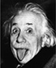

# Bienvenue chez

## Qu'est-ce qu'un environnement d'apprentissage optimisé ?

Chez BeCode, nous faisons en sorte ne pas être une école comme les autres. Les méthodes d'apprentissages ne sont pas ordinaires, la relation "professeur/élève" étant fortement différente de l'enseignement traditionnel. Concrètement, il s'agit de communiquer énormément et surtout, de collaborer.

## Communication

Notre force chez BeCode, est de représenter une entreprise modèle grâce au partage de soi, de nos connaissances et de nos expériences de vies.
Nos différents projets nous poussent à *communiquer* sans arrêt, **_avec fun et interaction._**

> _La communication consiste à comprendre celui qui écoute (Robert Sabatier)_

## Comment communique-t-on et travaillons-nous chez BeCode ?

La communication est la base de la pédagogie active.
 
1. La pédagogie active est au centre même de la formation. 
  *  L'apprenti est poussé à trouver par lui-même les solutions aux problèmes rencontrés.
  *  La pratique est au coeur même de la formation, l'étudiant doit pouvoir comprendre, assimiler et réutiliser ce qu'il a vu.
  *  Le groupe est poussé à communiquer et à échanger le maximum.

2. Via des projets

3. Via un auto apprentissage

## Quelles sont les valeurs qui sont pronếes au sein de BeCode ?

* L'entraide, le partage 
* L'autonomie, aller au fonds des choses
* La confiance en soi

## Objectifs

Le but principal de la formation est de devenir Developpeur Web indépendant et qualifié. A côté de cela, des objectifs sont réalisés au quotidien lors des épreuves ou travaux ( individuel ou de groupes ). Par exemple, l'objectif du dépassement de soi et la résolution de problèmes par soi-même.

Suivez nos aventures et progrès en cliquant [ici](www.becode.org)

Citation :
  > "La vie, c'est comme une bicyclette, il faut avancer pour ne pas perdre l'équilibre", Albert Einstein

